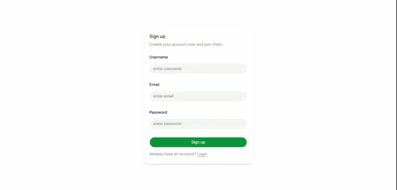

# TalkBox

TalkBox is a real-time chat application built with the MERN stack and Socket.IO.

I built this project to get hands-on experience with backend development, JWT authentication, REST APIs, MongoDB, and real-time communication using WebSockets.

## Features

- User registration and login
- JWT authentication
- Real-time messaging
- Online user status
- Conversation history
- Responsive interface
- Automatic scrolling to new messages
- Loading states

## Tech Stack

### Frontend

- React
- Vite
- Tailwind CSS
- Axios
- Socket.IO Client
- React Router
- date-fns

### Backend

- Node.js
- Express
- MongoDB
- Mongoose
- Socket.IO
- JWT
- bcrypt

## Running the Project

### 1. Clone the repository

```bash
git clone <repository-url>
cd talkbox
```

### 2. Backend

```bash
cd server
npm install
```

Create a `.env` file from `.env.example`.

```bash
npm run dev
```

### 3. Frontend

```bash
cd client
npm install
```

Create a `.env` file from `.env.example`.

```bash
npm run dev
```

## Environment Variables

### Backend

```
PORT=
MONGO_URI=
JWT_SECRET=
CLIENT_URL=
```

### Frontend

```
VITE_API_URL=
```

## Demo

### Desktop



### Mobile


